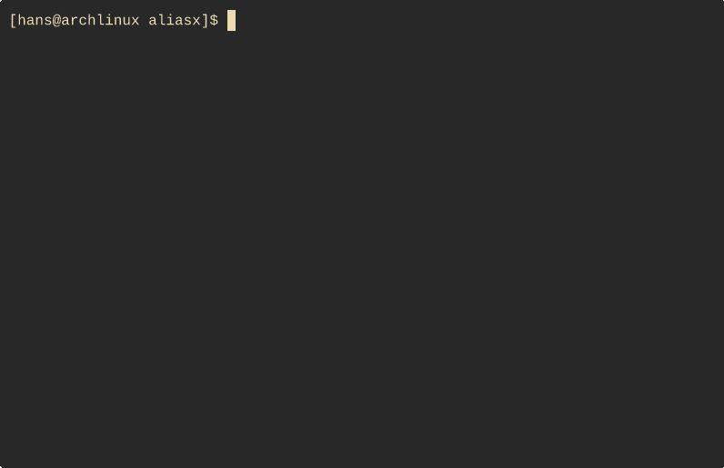

# aliasx

**Alias e(x)tended** – a CLI tool to manage tasks, aliases, and build handles efficiently.

## Features

For full feature set see the [documentation](docs/README.md)

- Lightweight and fast command-line interface
- Task and alias management
- Build automation helpers
- Compatible with `.vscode/tasks.json`
- Global and/or project based configs
- Fuzzy finder support
- Variable inputs

### Future features

- Fully support all parameters in the vscode tasks
- Support variable inputs
    - instead of fixed input types also support manually inputting a variable
- Convert vscode.json file to aliasx.yaml syntax
- Conditionals - only enable tasks given some constraints
- Depends on - trigger other tasks before running this one
- Create base config - prompt aliasx to create some "boiler plate configs"

## Demo

<p align="center">
  
</p>

(see [`.aliasx.yaml`](.aliasx.yaml) for documentation of the tasks in the demo)


## Installation

### Pre-built Releases

Download the latest release from [GitHub Releases](https://github.com/hansbinderup/aliasx/releases) for your platform.

### Arch Linux - AUR Package

Install via your preferred AUR helper, eg:

```bash
yay -S aliasx
```

### Using cargo

Install with cargo:

```bash
cargo install --git https://github.com/hansbinderup/aliasx/
```

## Development

### How to build

1. Install `cargo` with your preferred package manager
2. Run `cargo build`


### How to contribute

Feel free to open issues with suggestions. Or even better, open a pull request where you implement it yourself :)

### Motivation

1. I'm a happy neovim user while working on projects where build system utilizes the vscode tasks. I needed a simple way to explore these tasks from the cmdline while not breaking my flow.
2. I have waay too many aliases - I'm working in so many different repos where I've replaced a lot of tasks with aliases. It's messy and it doesn't scale well.
